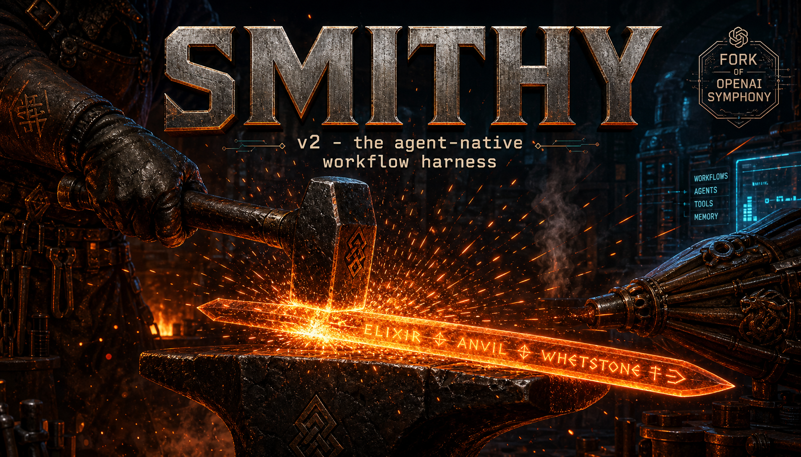

<p align="center">
  
</p>

# Smithy

> A conductor for multi-repo coding-agent work.

Smithy is the thin conductor that supervises one or more Symphony daemons. The
per-repo daemon is still Symphony, and this repo keeps that upstream lineage
explicit.

There are two binaries and two responsibilities:

| Binary | Lives in | Responsibility |
| --- | --- | --- |
| `wrapper/bin/smithy` | `wrapper/` | Smithy-native conductor: CLI surface, repo registry, launchd plist generation, aggregate TUI, hold-harmless gate, dashboard/log helpers, and multi-repo supervision. |
| `elixir/bin/symphony` | `elixir/` | Symphony fork: one daemon per registered repo, Linear polling loop, per-issue workspaces, state machine, Phoenix dashboard, workpad management, and agent dispatch. |

The short version: Smithy starts and watches N Symphony instances; each Symphony
instance works one repo.

## Why This Shape

The useful unit of autonomous work is still a single repo, a single workflow
file, and a single Linear ticket. Symphony already has that shape: OTP
supervision, per-issue workspaces, a Phoenix LiveView dashboard, Linear polling,
and the Codex app-server runtime.

Smithy's job is different. It gives an operator one local control plane across
many repos, with cross-model review and a small opinion layer around modes,
runtimes, personas, MCP scoping, and handoff artifacts. Keeping the conductor
thin avoids rebuilding Symphony while still making multi-repo operation feel
coherent.

For the full architecture, see [`v2/SPEC.md`](v2/SPEC.md). For failure modes,
see [`v2/edge-cases.md`](v2/edge-cases.md).

## What Is A Fork

`elixir/` is a fork of [OpenAI Symphony](https://github.com/openai/symphony).
It stays Symphony: same broad daemon shape, same runtime lineage, same
Apache-2.0 base. Smithy's opinion layer for per-repo work lives here:

- workflow `agents:` config
- `builder`, `reviewer`, and `triager` modes
- Codex and Claude Code runtime adapters
- persona and MCP bundle loading
- `REVIEW.md` and `TRIAGE.md` handoff parsing
- workpad section management
- state transitions around `Adversarial Review`, `Rework`, `Merging`, and `Done`

`wrapper/` is not a fork. It is Smithy-native code that does not exist upstream.
It owns machine-local supervision and operator UX around Symphony instances.

## Layered Architecture

```text
Smithy wrapper (wrapper/bin/smithy)
├── ~/.smithy/config.toml repo registry
├── hold-harmless acknowledgement gate
├── launchd plist generation per registered repo
├── CLI commands
│   ├── smithy add-repo / remove-repo / list-repos
│   ├── smithy daemon start|stop|restart [slug]
│   ├── smithy status [--web] [--json]
│   ├── smithy bellows / smithy forge
│   ├── smithy dashboard [slug]
│   └── smithy logs <slug> [--follow]
└── aggregate status over each Symphony HTTP API
        │ supervises
        ▼
Symphony daemon (elixir/bin/symphony, one per repo)
├── Linear polling loop
├── per-issue workspaces
├── workflow config and prompt rendering
├── state machine
├── Phoenix LiveView dashboard and /api/v1/state
├── workpad comment management
├── mode dispatch: builder | reviewer | triager
└── runtime dispatch: codex | claude_code
        │ spawns
        ▼
Agent subprocess
├── Codex CLI or Claude Code CLI
├── one mode, runtime, persona, MCP scope, and tier
├── JSONL/stdout events parsed by Symphony
└── RESULT.md, REVIEW.md, or TRIAGE.md handoff artifact
```

The boundary between Smithy and Symphony is process supervision plus local
HTTP/status files. The boundary between Symphony and agents is stdio plus
workspace files.

## Install And First Run

Prerequisites:

- Erlang/Elixir managed by [`mise`](https://mise.jdx.dev/)
- Codex CLI authenticated for the builder runtime
- Claude Code CLI authenticated if you configure a Claude reviewer
- `gh` authenticated if agents need to open pull requests
- `LINEAR_API_KEY` available in the shell that registers or starts daemons

Build the two binaries from the repo root:

```bash
cd wrapper
mise exec -- mix deps.get
mise exec -- mix escript.build

cd ../elixir
mise exec -- mix deps.get
mise exec -- mix escript.build

cd ..
```

The wrapper's generated launchd plist defaults to `/usr/local/bin/symphony`.
For local development, either put the built Symphony binary there or set
`symphony_binary` in `~/.smithy/config.toml` to the absolute path of
`./elixir/bin/symphony`.

Then acknowledge the local-agent operating model and register a repo:

```bash
./wrapper/bin/smithy acknowledge
./wrapper/bin/smithy add-repo <slug> <path> --workflow elixir/WORKFLOW.md
```

`add-repo` writes the repo entry to `~/.smithy/config.toml`, assigns the first
free port starting at `4001`, creates logs under `~/.smithy/logs/<slug>/`, and
writes a launchd plist at
`~/Library/LaunchAgents/com.shawnpetros.smithy.<slug>.plist`.

Start and operate the daemon:

```bash
./wrapper/bin/smithy daemon start <slug>
./wrapper/bin/smithy status
./wrapper/bin/smithy bellows
./wrapper/bin/smithy forge
./wrapper/bin/smithy dashboard <slug>
./wrapper/bin/smithy logs <slug>
```

For the self-hosting maiden voyage shape, the registered repo is this repo and
the workflow is [`elixir/WORKFLOW.md`](elixir/WORKFLOW.md). The operator path is
captured in
[`v2/history/2026-05-12-maiden-voyage-walkthrough.md`](v2/history/2026-05-12-maiden-voyage-walkthrough.md):
start the daemon, watch `smithy status`, open `smithy dashboard <slug>`, and
tail `smithy logs <slug>` while Symphony picks up `agent-ready` Linear tickets.

## Workflow Agents

Modes are configured per workflow in the YAML frontmatter `agents:` block:

```yaml
agents:
  builder:
    mode: builder
    runtime: codex
    tier: medium
    mcp:
      - linear-read

  reviewers:
    - mode: reviewer
      runtime: claude_code
      persona: reviewer.md
      tier: sonnet
      mcp: []

  triager:
    mode: triager
    runtime: codex
    persona: triager.md
    tier: low
    mcp:
      - linear-read
```

The three modes:

- `builder` is the normal implementation worker. It reads the ticket, edits the
  workspace, validates, opens or updates a PR, and moves the issue to
  `Adversarial Review` when a reviewer is configured.
- `reviewer` is the in-process Anvil port. It reads the PR diff and workpad,
  writes `REVIEW.md`, and returns pass/fail/blocker findings for Symphony to
  apply to Linear.
- `triager` is the spec-quality gate. It reads a queued ticket, writes
  `TRIAGE.md`, and either lets the builder proceed or sends underspecified work
  back to `Backlog` with `needs-spec`.

The two runtimes:

- `codex` is the default builder runtime. The v2 contract is to run Codex as a
  subprocess boundary with user config ignored via `--ignore-user-config`, then
  re-add project-scoped settings such as MCP servers explicitly.
- `claude_code` is the current YAML key for the Claude Code runtime, written as
  `claude-code` in some architecture prose. It runs `claude -p` with
  `--setting-sources project,local`, stream-json output, explicit model tier,
  and generated MCP config when a workflow declares MCP bundles.

Both runtimes are invoked by Symphony. The Smithy wrapper never talks to model
CLIs directly.

## Anvil Status

[Anvil](https://github.com/shawnpetros/anvil) is no longer a required sibling
daemon for Smithy users. Its reviewer contract has been ported into the
Symphony fork as `mode: reviewer`: the reviewer reads the diff and workpad,
writes `REVIEW.md`, and lets Symphony transition the ticket.

Vanilla Symphony users can still run Anvil as a sibling process if they want the
reviewer without the rest of Smithy's conductor and workflow opinions.

## What Ships In `v2.0.0-alpha-1`

Alpha-1 is the first conductor-plus-fork cut:

- Smithy wrapper escript in `wrapper/`
- hold-harmless acknowledgement gate
- repo registry in `~/.smithy/config.toml`
- launchd plist generation for each registered repo
- aggregate `smithy status` TUI plus `bellows` and `forge` aliases
- dashboard launcher and log tail commands
- Symphony fork in `elixir/`
- workflow `agents:` schema with builder, reviewer, and optional triager slots
- mode dispatch for `builder`, `reviewer`, and `triager`
- Codex and Claude Code runtime adapter surfaces
- persona library under `elixir/priv/personas/`
- MCP bundle library under `elixir/priv/mcp_bundles/`
- `REVIEW.md` and `TRIAGE.md` parsers
- extracted workpad management
- Phoenix dashboard and `/api/v1/state` endpoint for per-repo status
- universal `AGENTS.md` template under `elixir/priv/templates/`
- the maiden-voyage operator walkthrough in `v2/history/`

The detailed dependency order is in
[`v2/SPEC.md`](v2/SPEC.md#what-ships-in-v1-the-tomorrow-morning-cut).

## Roadmap

Near-term polish includes the native unified browser dashboard, SQLite run
history, streaming worker stdout, cost rollups, mediator mode, dependency
gating, model-tier overrides, and service-account identity for GitHub/Linear.

Longer-term v3 ambitions include summarized run logs, PR walkthrough media,
reviewer panels, multi-tracker support, phased pipelines, ETA estimation, and a
hosted managed service.

See
[`v2/SPEC.md` "What's deferred"](v2/SPEC.md#whats-deferred-v2-polish-v3-ambitions)
for the maintained list.

## The Naming Family

- **[Anvil](https://github.com/shawnpetros/anvil)** is the standalone Rust
  adversarial-review daemon. It remains useful for vanilla Symphony users; for
  Smithy users, its reviewer role is now `mode: reviewer` inside the Symphony
  fork.
- **[Whetstone](https://github.com/shawnpetros/whetstone)** is a Rust executor
  for wave-protocol agent runs. Different shape, same family. Tickets are not
  its native unit; waves are.
- **[Salazar](https://github.com/shawnpetros/salazar)** is an autonomous
  code-from-spec orchestrator on the Claude Agent SDK. Planner, generator,
  evaluator loop with hard validator gates.
- **[smithy-v1](https://github.com/shawnpetros/smithy-v1)** is the original
  Rust prototype, archived. v2 is this conductor plus Symphony fork path.

Forge metaphor for free: Smithy is the workshop, Anvil is the tool, Whetstone
sharpens, Elixir is the language and the alchemical brew.

## Credits

Built on [OpenAI Symphony](https://github.com/openai/symphony). Credit where it
is due: the per-repo daemon model, OTP supervision, Phoenix LiveView dashboard,
structured agent runtime surface, and Codex app-server integration all come
from upstream Symphony. Smithy adds the conductor plus the workflow opinions in
the fork.

## License

Apache-2.0, matching Symphony upstream. The upstream `LICENSE` and `NOTICE`
files in this repo carry attribution.
