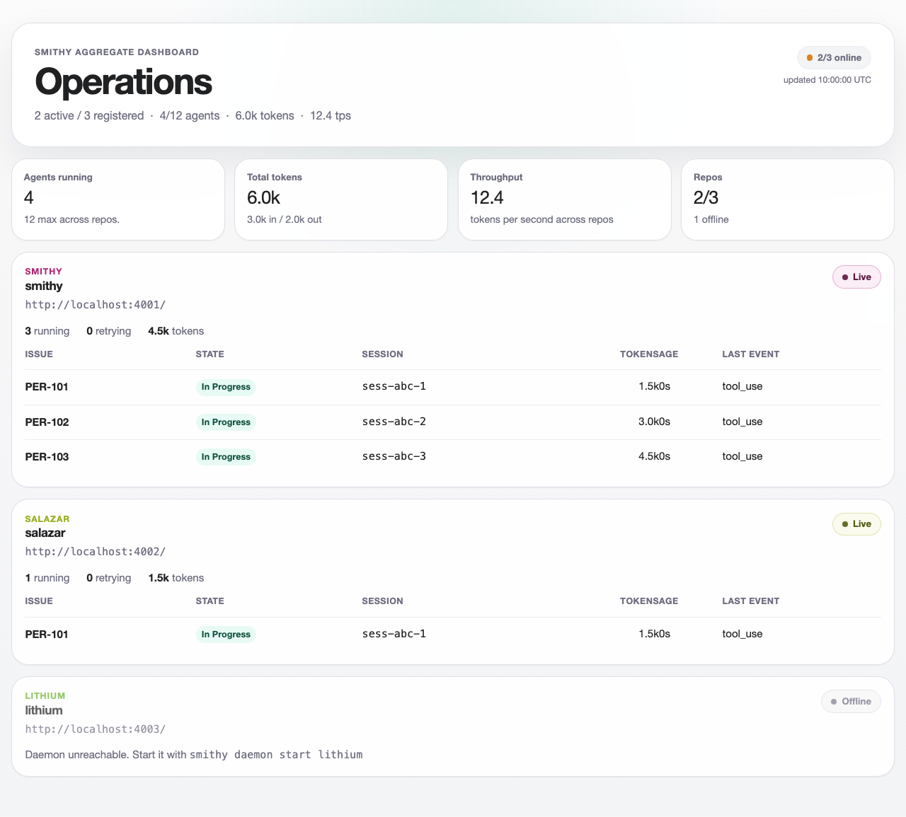

# Smithy wrapper

Thin CLI + supervisor that runs N Symphony daemons across N repos and gives you
one aggregate view. Block D of [v2/SPEC.md](../v2/SPEC.md).

## Status

v1, macOS-first. Linux `systemd` unit support is a follow-up.

## Build

```
cd wrapper
mise install
mise exec -- mix deps.get
mise exec -- mix escript.build
./bin/smithy --help
```

## Layout

```
wrapper/
  mix.exs
  mise.toml
  lib/smithy/
    cli.ex             # Escript entry; subcommand dispatch
    config.ex          # ~/.smithy/config.toml reader/writer
    repo_registry.ex   # CRUD on registered repos
    supervisor.ex      # launchd plist generation + launchctl wrappers
    status.ex          # /api/v1/state aggregation
    tui.ex             # ANSI rendering
    dashboard.ex       # aggregate HTML dashboard generator; opens in browser
    logs.ex            # log tail
    commands/          # one module per subcommand for testability
  priv/templates/
    launchd.plist.eex
  test/
```

## CLI surface

```
smithy --help
smithy version
smithy add-repo <slug> <path> [--workflow PATH] [--port PORT]
smithy remove-repo <slug>
smithy list-repos
smithy status [--web] [--json] [--snapshot] [--interval 5s]
                                     # bellows / forge are aliases
smithy dashboard [slug]
smithy logs <slug> [--follow]
smithy daemon {start|stop|restart} [slug]
```

## Config

`~/.smithy/config.toml`:

```toml
default_runtime = "codex"
default_workflow = "WORKFLOW.md"
symphony_binary = "/usr/local/bin/symphony"

[[repos]]
slug = "smithy"
path = "/Users/shawnpetros/projects/smithy"
workflow = "WORKFLOW.md"
port = 4001
```

If `symphony_binary` is unset it defaults to `/usr/local/bin/symphony`. Point it
at the locally-built monorepo binary (e.g. `/Users/you/projects/smithy/elixir/bin/symphony`)
during development.

## Plists

`smithy add-repo <slug>` writes
`~/Library/LaunchAgents/com.shawnpetros.smithy.<slug>.plist`. `KeepAlive.SuccessfulExit=false`
so the daemon respawns after Symphony's exit-75 self-update.

Logs land at `~/.smithy/logs/<slug>/{stdout,stderr}.log`.

## Aggregate dashboard

`smithy dashboard` fetches live state from every registered daemon, renders a
complete HTML page to `~/.smithy/dashboard.html`, opens it in your default
browser, and keeps the file updated every 5 seconds so the page's `meta-refresh`
tag picks up new data automatically. No iframes - the wrapper aggregates JSON
from each daemon and renders one unified view.



The page shows cross-repo totals (agents running, total tokens, throughput),
a per-repo section for each registered daemon, and muted red rendering for any
repo whose daemon is offline. Per-repo accent colors derive from the slug name
via a stable hash, matching the TUI colors from `smithy status`.

`smithy dashboard <slug>` opens `http://localhost:<port>/` for that specific
repo's Symphony LiveView instead.

## Aggregate TUI

`smithy status` queries each registered repo's `GET /api/v1/state` (the existing
endpoint exposed by `SymphonyElixirWeb.ObservabilityApiController.state/2`) and
enters a bordered, refreshing aggregate terminal UI. It redraws every second by
default, supports `q`/Ctrl-C to quit, `r` to refresh immediately, `?` to toggle
expanded help, and arrow keys or `j`/`k` to scroll overflowing rows. Offline repos
render as `[slug] OFFLINE — daemon down` rather than crashing the aggregate.

`--snapshot` emits a single ANSI frame suitable for scripts that expect one-shot
terminal output. `--json` emits structured output suitable for piping.

## Tests

```
mise exec -- mix test
```

Tests inject deps (config load/write, launchctl runner, HTTP client) so the
launchctl/open paths are never hit on a test host.

## Deviations from the spec

- Spec writes the plist template under `lib/smithy/priv/templates/`. Standard
  Elixir convention puts `priv/` at the project root and we follow it. The
  template content matches the spec exactly.
- The macOS Linux split is documented but not implemented; v1 is macOS-only.
- The legacy `~/.smithy/config.toml` (linear_teams, repo_paths, etc.) used by
  the old Symphony daemon coexists with the new `[[repos]]` array. Unknown
  top-level keys round-trip through `Config.write/2` via the `:extras` map.
